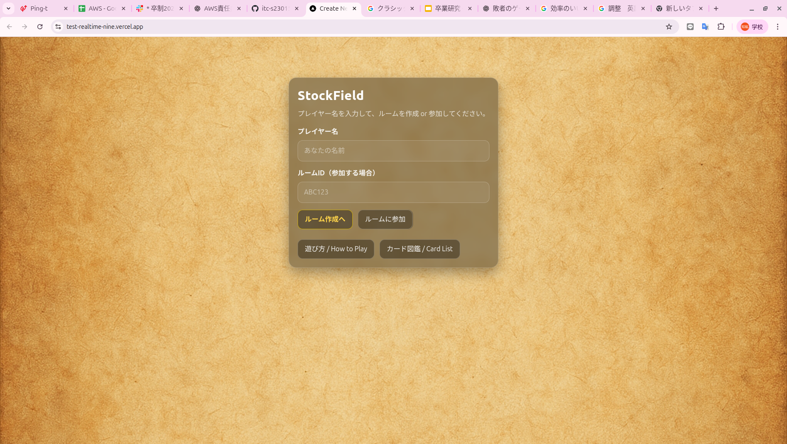
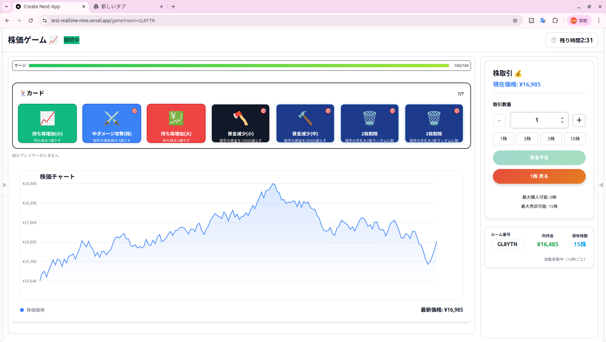

# TEST-REALTIME

## 概要
**株取引**と**カードゲーム**を組み合わせた**複数人対戦可能なリアルタイム型の対戦ゲーム**

## デモ
https://test-realtime-nine.vercel.app/

現在は利用できません。

## 使用技術
Ably
Next.js
git
VSCode

## 仕様
**制限時間は３分**
このゲームには**10秒に一度上昇・下降する形で動く**株のチャートがある
**カード**を利用して自身や相手の**持ち株を増減**したり、**チャートを操作**したりできる
**所持金**を使って株を購入したり、持ち株を売却して所持金を増やすことができる
**ランダムなイベント**（例　株価の高騰　株価の暴落など）

##　遊び方
部屋を作成/参加

**ホーム画面**

カードを配布

株の売買orカードの使用!

３分後に終了
**合計の所持金が一番高い人の勝利**

## 注意点
**スマホ版非対応**

## 開発者
s23005

s23009

s23015